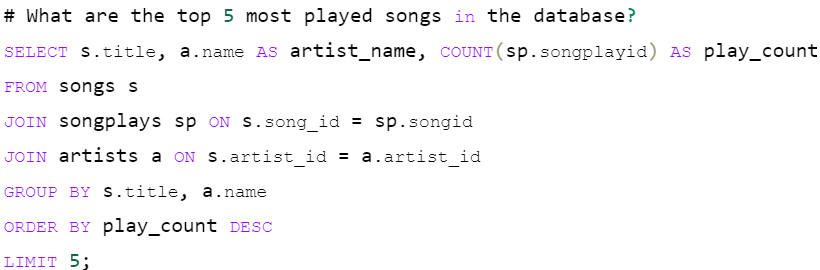
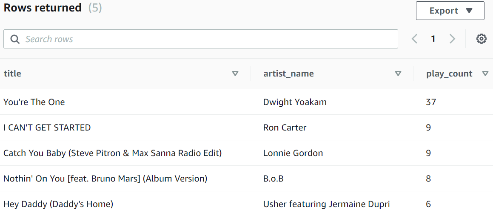
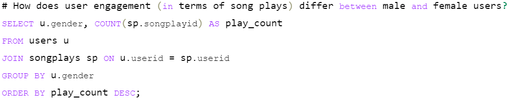
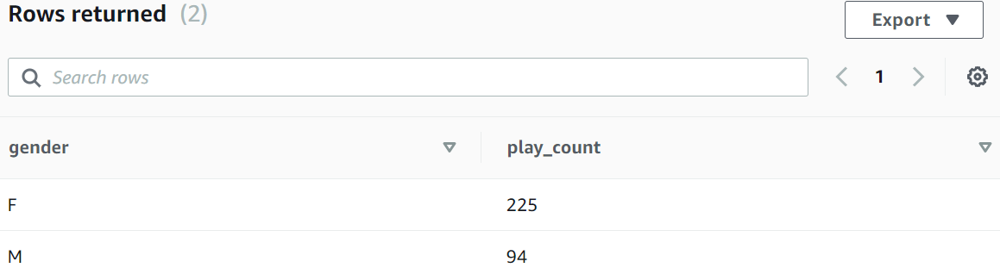

## AWS-sparkify-ETL-project
This project implements an ETL pipeline to transform raw event data into actionable insights within a cloud-based data warehouse. Leveraging AWS technologies, we analyze user behavior and song trends in the Sparkify music streaming application.

### Purpose of the Database
The primary purpose of this database is to support the analytical goals of Sparkify, a music streaming startup that aims to enhance user experience and drive engagement through data-driven insights. By analyzing song play data, Sparkify can uncover user behavior patterns, preferences, and trends, enabling the company to make informed decisions about marketing strategies, music recommendations, and overall platform enhancements.

Through this database, Sparkify can answer key questions such as:

What are the most popular songs and artists among users?
How do user engagement levels vary across different demographics?
What times of day or days of the week see the highest song play activity?
What features or changes can be implemented to improve user retention?
Overall, the database serves as a critical tool for Sparkify to leverage its data for growth and optimization in a competitive market.

### Some Examples:

#### Question: What are the top 5 most played songs in the database?

#### Question: How does user engagement (in terms of song plays) differ between male and female users?

### Database Schema Design and ETL Pipeline
#### Schema Design
The database schema is designed as a star schema, consisting of one fact table and four dimension tables, optimized for efficient querying and analysis of song play events. The schema includes:

Fact Table: songplays

Columns: songplay_id, start_time, user_id, level, song_id, artist_id, session_id, location, user_agent
This table records the events associated with song plays, enabling the analysis of user interactions with the platform.
Dimension Tables:

users: Contains user demographics and subscription level to understand user behavior and segmentation.
Columns: user_id, first_name, last_name, gender, level

songs: Stores information about songs available in the music database for song popularity analysis.
Columns: song_id, title, artist_id, year, duration

artists: Provides details about artists to analyze trends in artist popularity and engagement.
Columns: artist_id, name, location, latitude, longitude

time: Breaks down timestamps to facilitate time-based analysis of song play activities.
Columns: start_time, hour, day, week, month, year, weekday

This design allows for efficient joins between the fact and dimension tables, enabling complex queries to be executed swiftly, which is crucial for analytical performance.

### ETL Pipeline
The ETL (Extract, Transform, Load) pipeline is designed to automate the process of loading data from S3 into the Redshift database, ensuring that the data is consistently updated and structured for analysis. The key components of the ETL process are:

Extract: Data is extracted from S3, where raw event and song datasets are stored in JSON format.

Transform: Data is transformed to fit the schema of the staging tables in Redshift, ensuring compatibility with the dimension and fact tables. This includes data cleansing, deduplication, and type conversions as necessary.

Load:
Load the transformed data into staging tables, followed by the population of the fact and dimension tables.

Note: The songplays table is populated using a combination of data from the event and song datasets, ensuring a comprehensive view of user interactions.
Other dimension tables are populated with relevant data, ensuring referential integrity between the tables.

The ETL process is implemented in the etl.py file, and the overall architecture allows for easy updates and maintenance of the data, aligning with Sparkify's need for a dynamic and scalable analytical solution.

### File Structure
The project includes the following files:

#### **`execution_notebook.ipynb`**: Jupyter notebook for executing and testing queries/scripts.
#### create_cluster_resources.py: Script for creating the necessary AWS resources.
create_tables.py: Script for creating the database schema in Redshift.
delete_cluster_resources.py: Script for cleaning up AWS resources.
dwh.cfg: Configuration file containing connection details for the Redshift database.
etl.py: Script for loading and transforming data into Redshift.
README.md: This README file providing project details and documentation.
sql_queries.py: Contains SQL statements used in the ETL process and table creation.

### Conclusion
This project establishes a robust data infrastructure for Sparkify, enabling the company to gain valuable insights into user behavior and song popularity. The combination of a well-structured database schema and a comprehensive ETL pipeline lays the foundation for effective data analysis, ultimately contributing to Sparkify's growth and success in the music streaming industry.
